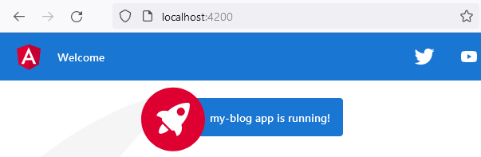

# ch2 prj

<details>
  <summary>ch2</summary>
  
  ### my blog

1. init app w bootstrap, routing & scss
<!-- 1. Foo
2. Bar
   - Baz
   - Qux -->

```js
ng new my-blog --routing --style=scss --directory ./

npm i bootstrap
// npm i bootstrap-icons

`styles.scss`
@import "~bootstrap/dist/css/bootstrap.min.css";
// @import "~bootstrap-icons/font/bootstrap-icons.css";
// @import "~bootstrap/scss/bootstrap.scss";
```

2. add repo

```js
echo "# book-prj" >> README.md
git init
git add README.md
git commit -m "first commit"
git branch -M main
git remote add origin git@github.com:viktishchenko/book-prj.git
git push -u origin master
```



</details>
