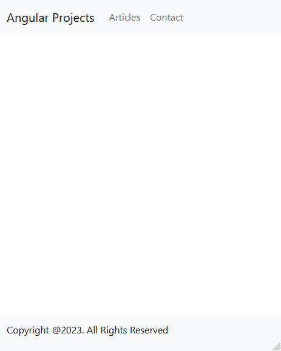
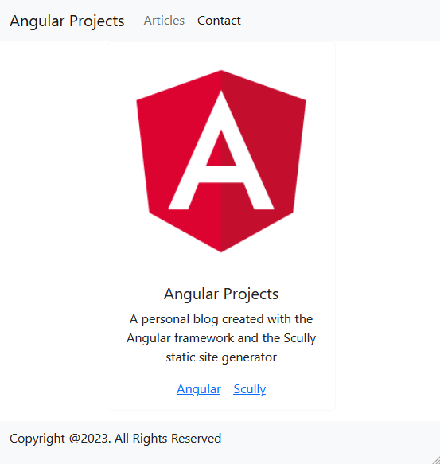
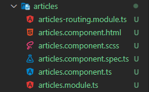
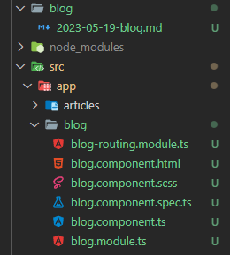
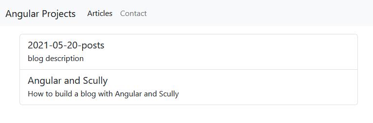
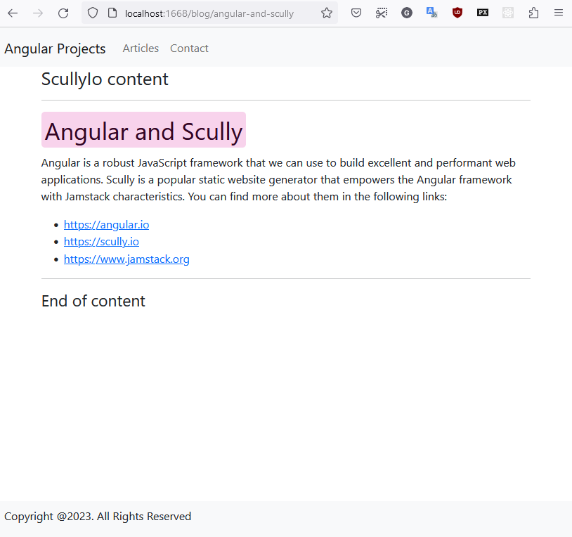

# ch2 prj

<details>
  <summary>ch2</summary>
  
  ### my blog

1. init app w bootstrap, routing & scss
<!-- 1. Foo
1. Bar
   - Baz
   - Qux -->

```js
ng new my-blog --routing --style=scss --directory ./

npm i bootstrap
// npm i bootstrap-icons

`styles.scss`
@import "~bootstrap/dist/css/bootstrap.min.css";
// @import "~bootstrap-icons/font/bootstrap-icons.css";
// @import "~bootstrap/scss/bootstrap.scss";
```

2. add repo

```js
echo "# book-prj" >> README.md
git init
git add README.md
git commit -m "first commit"
git branch -M main
git remote add origin git@github.com:viktishchenko/book-prj.git
git push -u origin master
```


</details>

<details>
  <summary>ch2.1</summary>

1. basic layout

- only once comp

```js
ng generate module core --dry-run

ng generate component header --path=src/app/core --module=core --export --dry-run
```

- more than once comp

```js
ng g m shared --dry-run

ng g c footer --path=src/app/shared --module=shared --export --dry-run
```



</details>

<details>
  <summary>ch2.2</summary>

1. configurate routing

- add contact page

```js
 ng g m contact --dry-run

// same folder
 ng generate component contact --path=src/app/contact --module=contact --export --flat --dry-run

// add router module
 `core.module.ts`
import { RouterModule } from '@angular/router';

@NgModule({
  imports: [RouterModule],
})

```



2. add articles lazy routing&page&module

```javascript
ng generate module articles --route=articles --module=app-
routing --dry-run
```



- add default route

```javascript
{ path: '', pathMatch: 'full', redirectTo: 'articles' },
{ path: '**', redirectTo: 'articles' }
```

</details>

<details>
  <summary>ch2.3</summary>

1. Scully library

- install @scully

```js
// ng add @scullyio/init
ng add @scullyio/init --project=my-blog

// add scully module `app.module.ts`
import { ScullyLibModule } from '@scullyio/ng-lib';

@NgModule({
imports: [
ScullyLibModule
],
})
```

- add `scully.my-blog.config.ts`

```js
import { ScullyConfig } from "@scullyio/scully";
export const config: ScullyConfig = {
  projectRoot: "./src",
  projectName: "my-blog",
  outDir: "./dist/static",
  routes: {},
};
```

- fix `no scully configuration...does not exist.`

```js
// angular.json
"defaultProject": "my-blog",
```

- init blog page

```js
ng generate @scullyio/init:markdown
```



- fix : index signature, error (Property 'fName' comes...ts4111)

```js
      <p class="mb-1">
        {{ post?.['description'] }}
      </p>
```

- display mock



</details>

<details>
  <summary>ch2.end</summary>

1. build Angular app

```js
ng build
```

2. build scully (generate static blog)

```js
ng build

// serser
npm run scully:serve

// force Scully to regenerate the routes
npm run scully
// res
npm run scully:serve
```

3. add post

```js

// generate a Markdown file named angular-and-scully.md
ng generate @scullyio/init:post --name="Angular and Scully"

// update its content
---
title: 'Angular and Scully'
description: 'How to build a blog with Angular and
Scully'
published: true
---
# Angular and Scully
Angular is a robust JavaScript framework that we can use
to build excellent and performant web applications.
Scully is a popular static website generator that
empowers the Angular framework with Jamstack
characteristics.
You can find more about them in the following links:
- https://angular.io
- https://scully.io
- https://www.jamstack.org


// create a route for the newly created blog post
npm run scully
```



</details>

### fin :smirk:
