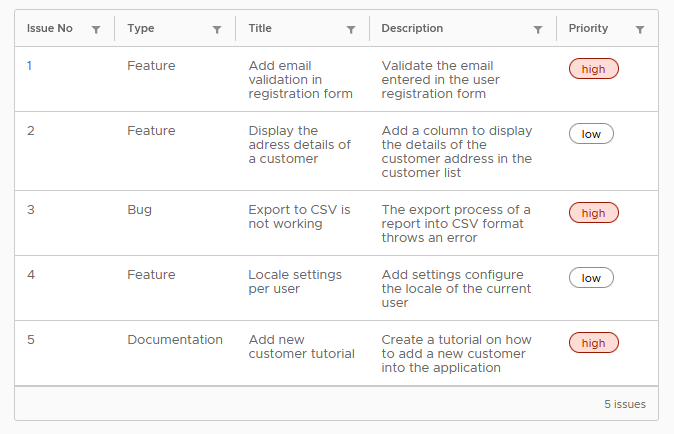
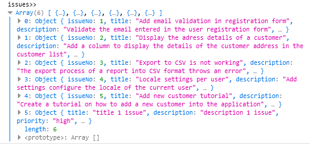
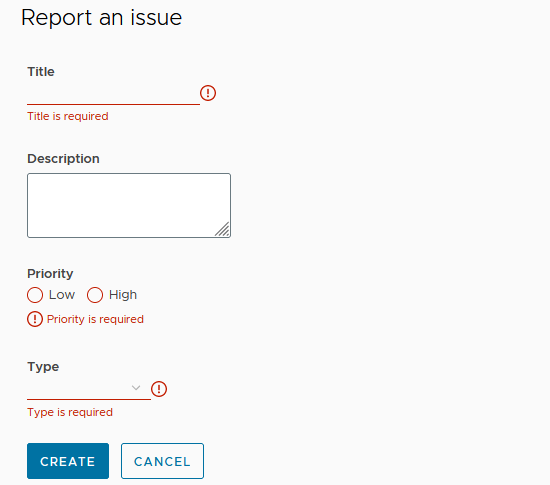
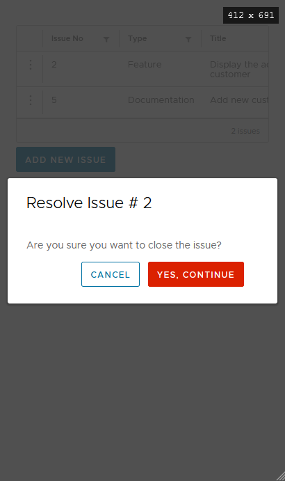

# ch3 prj

<details>
  <summary>ch3</summary>
  
  ### is-tracker app

```js
// --defaults: disables Angular routing and sets the styles CSS.
ng new is-tracker --defaults  --directory ./

// add Clarity library
npm i @clr/angular@15.2.0 // !
npm i @clr/ui@15.2.0    // !
npm install @cds/core

// add styles
`angular.json`
"styles": [
"node_modules/@clr/ui/clr-ui.min.css",
]

// import clarity + browser animation module
`app.module.ts`
import { ClarityModule } from '@clr/angular';
import { BrowserAnimationsModule } from
'@angular/platform-browser/animations';

@NgModule({
declarations:
imports: [
ClarityModule,
BrowserAnimationsModule
],

```

</details>

<details>
  <summary>ch3.1</summary>

- add service w interface

```js
ng g s issue --skip-tests --dry-run
ng generate interface issue
```

- get all pending cases w service

```js
getAllPendingCases(){
   return this.issues.filter(issue=>!issue.completed)
}
```

- add component, display data w clarity

```js
ng generate component issue-list dry-run

// property binding e.g.
[class.label-danger]="issue.priority === 'high'"
```

- [class & style binding](https://angular.io/guide/class-binding)

```js
[class.label-danger]="issue.priority === 'high'"
```



</details>

<details>
  <summary>ch3.2</summary>

### reporting new issues (Angular reactive forms)

- set up reactive forms
- create issue form
- display issue list
- validating details

`app.module.ts`

```js
import { ReactiveFormsModule } from '@angular/forms';

@NgModule({
imports: [
ReactiveFormsModule
],
})
```

- add comp, reactive forms, addIssueMethod

```js
ng g c  issue-report --dry-run


// init reactive form

`ts`

  issueForm: FormGroup | undefined;

  constructor(private form: FormBuilder) {}

  ngOnInit(): void {
    this.issueForm = this.form.group({
      title: [''],
      description: [''],
      priority: [''],
      type: [''],
    });
  }

`html`
// basic
<form clrForm *ngIf="issueForm" [formGroup]="issueForm">
    <input clrInput formControlName="title" />
    <textarea clrTextarea formControlName="description"></textarea>
      <input type="radio" value="low" clrRadio formControlName="priority" />
      <input type="radio" value="high" clrRadio formControlName="priority" />
    <select clrSelect formControlName="type">
      <option value="Feature">Feature</option>
      <option value="Bug">Bug</option>
      <option value="Documentation">Documentation</option>
    </select>
  <button class="btn btn-primary" type="submit">Create</button>
</form>

```


- pass form value to issues object

```js
`issue-report.component.html`
// submit reactive form

(ngSubmit) = addIssue();

`issue-report.component.ts`
//add service
constructor(private issueService: IssueService){}

addIssue(){
  this.issueService.createIssue(this.issueForm?.value)
}

```



- displaying a new issue in the list
  - add EventEmitter property w @Output() decorator

`issue-report.component.ts`

```js
@Output() formClose = new EventEmitter();

addIssue() {
  this.formClose.emit();
}
```

`issue-report.component.html`

```js

<button (click)="formClose.emit()" class="btn" type="button">Cancel</button>
```

- IssueListComponent bind to the formClose event of IssueReportComponent

`issue-list.component.html`

```js
<app-issue-report
  *ngIf="showReportIssue == true"
  (formClose)="onCloseReport()"
></app-issue-report>

```

`issue-list.component.ts`

```js

showReportIssue = false;

onCloseReport() {
this.showReportIssue = false;
this.getIssues();
}

```

</details>

<details>
<summary>ch3.3</summary>

- form validation

```js
import { FormBuilder, FormGroup, Validators } from
'@angular/forms';

ngOnInit(): void {
this.issueForm = this.builder.group({
title: ['', Validators.required],
description: [''],
priority: ['', Validators.required],
type: ['', Validators.required]
});
}


addIssue() {
  if (this.issueForm && this.issueForm.invalid) {
    this.issueForm.markAllAsTouched();
    return;
  }
  ...
}

```



### resolving an issue

- add comp

```js
ng g c confirm-dialog --dry-run
```

- add @Input() decorator to get the issue number.

```js
@Input() issueNo: number | null = null;
```

- @Output() decorator will emit a boolean value

```js
@Output() confirm = new EventEmitter<boolean>();

// confirm output property (true || false)
agree() {
this.confirm.emit(true);
this.issueNo = null;
}
disagree() {
this.confirm.emit(false);
this.issueNo = null;
}
```

- clarity modal

```html
<clr-modal [clrModalOpen]="issueNo !== null"
[clrModalClosable]="false">
<button type="button" class="btn btn-outline"
(click)="disagree()">Cancel</button>
<button type="button" class="btn btn-danger"
(click)="agree()">Yes, continue</button>
</div>
</clr-modal>
```

`issue.service.ts`

```js
completeIssue(issue: Issue) {
// clone of the issue
const selectedIssue: Issue = {
...issue,
completed: new Date()
};
// replaces it with the cloned instance
const index = this.issues.findIndex(i => i ===
issue);
this.issues[index] = selectedIssue;
}
```

`issue-list.component.ts`

```js
selectedIssue: Issue | null = null;

onConfirm(confirmed: boolean) {
// call service if confirmed is true w refresh
if (confirmed && this.selectedIssue) {
this.issueService.completeIssue(this.
selectedIssue);
this.getIssues();
}
this.selectedIssue = null;
}
```

`issue-list.component.html`

```html
<clr-dg-action-overflow>
  <button
    class="action-item"
    (click)="selectedIssue
= issue"
  >
    Resolve
  </button>
</clr-dg-action-overflow>

// confirm-dialog
<app-confirm-dialog *ngIf="selectedIssue" [issueNo]="selectedIssue.issueNo" (confirm)="onConfirm($event)"></app-confirm-dialog>
```



</details>
