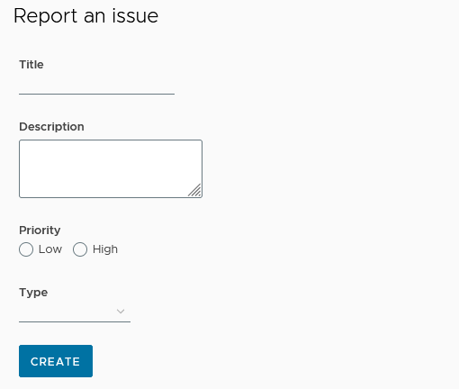

# ch3 prj

<details>
  <summary>ch3</summary>
  
  ### is-tracker app

```js
// --defaults: disables Angular routing and sets the styles CSS.
ng new is-tracker --defaults  --directory ./

// add Clarity library
npm i @clr/angular@15.2.0 // !
npm i @clr/ui@15.2.0    // !
npm install @cds/core

// add styles
`angular.json`
"styles": [
"node_modules/@clr/ui/clr-ui.min.css",
]

// import clarity + browser animation module
`app.module.ts`
import { ClarityModule } from '@clr/angular';
import { BrowserAnimationsModule } from
'@angular/platform-browser/animations';

@NgModule({
declarations:
imports: [
ClarityModule,
BrowserAnimationsModule
],

```

</details>

<details>
  <summary>ch3.1</summary>

- add service w interface

```js
ng g s issue --skip-tests --dry-run
ng generate interface issue
```

- get all pending cases w service

```js
getAllPendingCases(){
   return this.issues.filter(issue=>!issue.completed)
}
```

- add component, display data w clarity

```js
ng generate component issue-list dry-run

// property binding e.g.
[class.label-danger]="issue.priority === 'high'"
```

- [class & style binding](https://angular.io/guide/class-binding)

```js
[class.label-danger]="issue.priority === 'high'"
```


</details>

<details>
  <summary>ch3.2</summary>

### reporting new issues (Angular reactive forms)

- set up reactive forms
- create issue form
- display issue list
- validating details

`app.module.ts`

```js
import { ReactiveFormsModule } from '@angular/forms';

@NgModule({
imports: [
ReactiveFormsModule
],
})
```

- add comp, reactive forms, addIssueMethod

```js
ng g c  issue-report --dry-run


// init reactive form

`ts`

  issueForm: FormGroup | undefined;

  constructor(private form: FormBuilder) {}

  ngOnInit(): void {
    this.issueForm = this.form.group({
      title: [''],
      description: [''],
      priority: [''],
      type: [''],
    });
  }

`html`
// basic
<form clrForm *ngIf="issueForm" [formGroup]="issueForm">
    <input clrInput formControlName="title" />
    <textarea clrTextarea formControlName="description"></textarea>
      <input type="radio" value="low" clrRadio formControlName="priority" />
      <input type="radio" value="high" clrRadio formControlName="priority" />
    <select clrSelect formControlName="type">
      <option value="Feature">Feature</option>
      <option value="Bug">Bug</option>
      <option value="Documentation">Documentation</option>
    </select>
  <button class="btn btn-primary" type="submit">Create</button>
</form>

```



</details>
