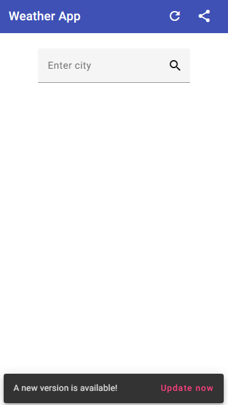

# WeatherPwaApp

This project was generated with [Angular CLI](https://github.com/angular/angular-cli) version 15.2.2.

## Development server

Run `ng serve` for a dev server. Navigate to `http://localhost:4200/`. The application will automatically reload if you change any of the source files.

## Code scaffolding

Run `ng generate component component-name` to generate a new component. You can also use `ng generate directive|pipe|service|class|guard|interface|enum|module`.

## Build

Run `ng build` to build the project. The build artifacts will be stored in the `dist/` directory.

## Running unit tests

Run `ng test` to execute the unit tests via [Karma](https://karma-runner.github.io).

## Running end-to-end tests

Run `ng e2e` to execute the end-to-end tests via a platform of your choice. To use this command, you need to first add a package that implements end-to-end testing capabilities.

## Further help

To get more help on the Angular CLI use `ng help` or go check out the [Angular CLI Overview and Command Reference](https://angular.io/cli) page.

---

<details>

<summary>ep.1</summary>

- init app w scss, w/o routing

```js
mkdir ch4
cd ch4 tab
ng new weather-pwa-app --style=scss --routing=false --directory ./

```

- add indigo-pink theme w typography & animation & Angular Material

```js
ng add @angular/material --theme=indigo-pink --typography=true
--animations=true

```

```html
// --theme=indigo-pink:
<!--
./node_modules/@angular/material/prebuilt-themes/indigo-
pink.css

<link href="https://fonts.googleapis.com/icon?family=Material+Icons" rel="stylesheet">
 -->

// --typography=true:
<!-- 
<link href="https://fonts.googleapis.com/css2?family=Roboto:wght@300;400;500&display=swap" rel="stylesheet">
</head>
<body class="mat-typography">
    <app-root></app-root>
</body>

// styles.scss
html, body { height: 100%; }
body { margin: 0; font-family: Roboto, "Helvetica Neue",
sans-serif; }
 -->

// --animations=true:
<!--
..
import { BrowserAnimationsModule } from '@angular/
platform-browser/animations';
@NgModule({
imports: [
BrowserAnimationsModule
]
})
  -->
```

- add environments

```js
ng generate environments
```

</details>

<details>

<summary>ep.2</summary>

- add interface

```js
ng g i models/weather --dry-run

```

- add HTTP client

`app.module.ts`

```js
import { HttpClientModule } from "@angular/common/http";

@NgModule({
declarations: [
AppComponent
],
imports: [
HttpClientModule
]
})
```

- add service

```js
ng g s services/weather --skip-tests --dry-run
```

- add method that accept city-name & requests API f that arg-t

```js
getWeather(city:string): Observable<IWeather>{
  const options = new HttpParams()
  .set('units','metrics')
  .set('g', city)
  .set('appId', environment.apiKey)
  return this.http.get<IWeather>(
    environment.apiUrl + 'weather', {params: options};
  )
}
```

- add display-info component w searchCity-meth

```js
ng g c views/weather --skip-tests --dry-run

search(city: string){
  this.weatherService.getWeather(city).subscribe(weather => this.weather = weather)
}
```

- import matModules smth...

```js
import { MatInputModule } from '@angular/material/input';
import { MatIconModule } from '@angular/material/icon';
import { MatFormFieldModule } from '@angular/material/form-field';
import { MatCardModule } from '@angular/material/card';

@NgModule({
  declarations: [AppComponent, WeatherComponent],
  imports: [
    BrowserModule,
    BrowserAnimationsModule,
    MatInputModule,
    MatIconModule,
    HttpClientModule,
    MatFormFieldModule,
    MatCardModule,
  ],
  providers: [],
  bootstrap: [AppComponent],
})

```



</details>

<details>

<summary>ep.3</summary>

- enable offline mode w service worker

```js
// install service worker
ng add @angular/pwa

// add server ( test pwa)
npm install -D http-server
ng build

// package.json scripts property
"scripts": {
"server": "http-server -p 8080 -c-1 dist/weather-app"
}

// run
npm run server

```


</details>
