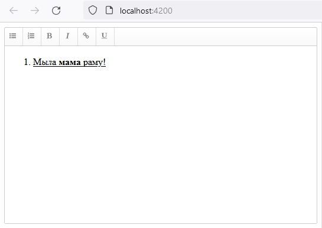
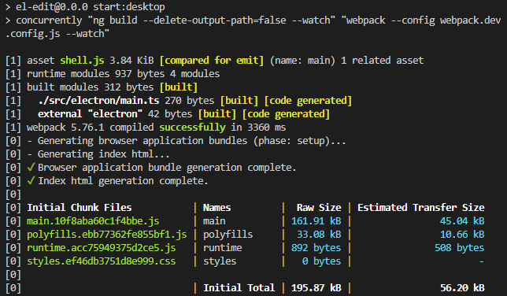

# ElEdit

This project was generated with [Angular CLI](https://github.com/angular/angular-cli) version 15.2.2.

## Development server

Run `ng serve` for a dev server. Navigate to `http://localhost:4200/`. The application will automatically reload if you change any of the source files.

## Code scaffolding

Run `ng generate component component-name` to generate a new component. You can also use `ng generate directive|pipe|service|class|guard|interface|enum|module`.

## Build

Run `ng build` to build the project. The build artifacts will be stored in the `dist/` directory.

## Running unit tests

Run `ng test` to execute the unit tests via [Karma](https://karma-runner.github.io).

## Running end-to-end tests

Run `ng e2e` to execute the end-to-end tests via a platform of your choice. To use this command, you need to first add a package that implements end-to-end testing capabilities.

## Further help

To get more help on the Angular CLI use `ng help` or go check out the [Angular CLI Overview and Command Reference](https://angular.io/cli) page.

---

<details>

<summary>ep.1</summary>

- init desktop angular app w text-editor lib

```js

ng new el-edit --defaults --directory ./ // --minimal

// text editor
npm i ngx-wig@15.1.4
```

- add host comp for editor

```js

ng g c views/editor --skip-tests  --dry-run

// editor.component
<ngx-wig placeholder="Enter your content"></ngx-wig>
```



</details>

<details>

<summary>ep.2</summary>

- convert it into a desktop one using Electron

```js

npm install -D electron
PS D:\work\prj-book\ch5\src> mkdir electron
PS D:\work\prj-book\ch5\src> cd .\electron\
PS D:\work\prj-book\ch5\src\electron> New-Item main.js

// init window
import { app, BrowserWindow } from 'electron';
function createWindow () {
const mainWindow = new BrowserWindow({
width: 800,
height: 600
});
mainWindow.loadFile('index.html');
}
app.whenReady().then(() => {
createWindow();
});
```

- add webpack CLI (build & bundle electron app)

```js

npm install -D webpack-cli
```

- add ts-loader f webpack

```js

npm install -D ts-loader

// run the Angular and Electron applications in parallel w:
npm install -D concurrently
webpack.dev.config.js
webpack.config.js
webpack.prod.config.js
// add to run
"start:desktop": "concurrently \"ng build --delete-output-path=false --watch\" \"webpack --config webpack.dev.config.js --watch\"",
/* the Angular CLI will delete the dist folder by default. To prevent this behavior using the --delete-
output-path=false option because the Electron application is also built in the same folder. */
```

- add launch.json file w (Run and Debug → create a launch.json)

```js
"program": "${workspaceRoot}/dist/my-editor/shell.js",
"runtimeExecutable": "${workspaceRoot}/node_modules/.bin/electron"
```

```js
npm run start:desktop
```



</details>
