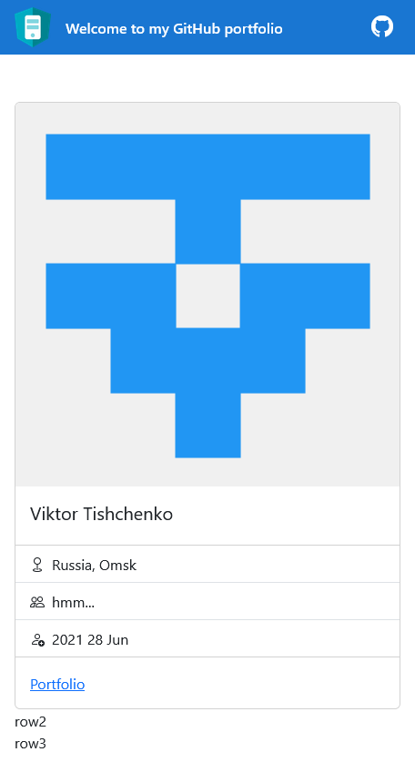

# AngFolio

This project was generated with [Angular CLI](https://github.com/angular/angular-cli) version 15.2.2.

## Development server

Run `ng serve` for a dev server. Navigate to `http://localhost:4200/`. The application will automatically reload if you change any of the source files.

## Code scaffolding

Run `ng generate component component-name` to generate a new component. You can also use `ng generate directive|pipe|service|class|guard|interface|enum|module`.

## Build

Run `ng build` to build the project. The build artifacts will be stored in the `dist/` directory.

## Running unit tests

Run `ng test` to execute the unit tests via [Karma](https://karma-runner.github.io).

## Running end-to-end tests

Run `ng e2e` to execute the end-to-end tests via a platform of your choice. To use this command, you need to first add a package that implements end-to-end testing capabilities.

## Further help

To get more help on the Angular CLI use `ng help` or go check out the [Angular CLI Overview and Command Reference](https://angular.io/cli) page.

---

<details>

<summary>ep.1</summary>

- init angular app w bootstrap&icons

```js
// disables routing because spa, use scss, current dir (check minimal)
ng new ang-folio --routing=false --style=scss --directory ./ // --minimal

npm i bootstrap
npm install bootstrap-icons
// `src/style.scss`
// when import w @import rule, wc omit file extension
@import "~bootstrap/dist/css/bootstrap.min.css";
@import "~bootstrap-icons/font/bootstrap-icons.css";

```

- add Angular logo [from](https://angular.io/presskit)

- add environments & basic layout

```js
ng generate environments

// add to `app.component.ts`
import { environment } from './../environments/environment';

export class AppComponent {
username = environment.username;
}
```


- add service, component, interface

```js
ng g s services/github --skip-tests --dry-run ng g c views/person-info --skip-tests --dry-run
ng g i modules/user --dry-run
```

- get user

```js
// `person-info.ts`
export class PersonInfoComponent implements OnInit {
  user$: Observable<IUser> | undefined;

  constructor(private githubService: GithubService) {}

  ngOnInit(): void {
    this.user$ = this.githubService.getUser();
  }
}
```

```html
// `person-info.html`
<div class="card" *ngIf="user$ | async as user">// ... smth</div>
/* The main advantage of the async pipe is that it unsubscribes from the observable automatically when a component is destroyed, avoiding potential memory leaks */
```



</details>

<details>

<summary>ep.2</summary>

- add comp (user repos listing), interface

```js
ng g c views/panel --skip-tests --dry-run
ng g i modules/repository --dry-run

```

- refactor service URL

```js
export class GithubService {

  private userUrl: string = '';

  constructor(private http: HttpClient) {
    // like this →
    this.userUrl = `${environment.apiUrl}/users/${environment.username}`;
  }

  getUser(): Observable<User> {
    //  →
    return this.http.get<User>(this.userUrl);
  }

  getRepos(): Observable<Repository[]> {
    //  →
    return this.http.get<Repository[]>(this.userUrl + '/repos');
  }
```

</details>
