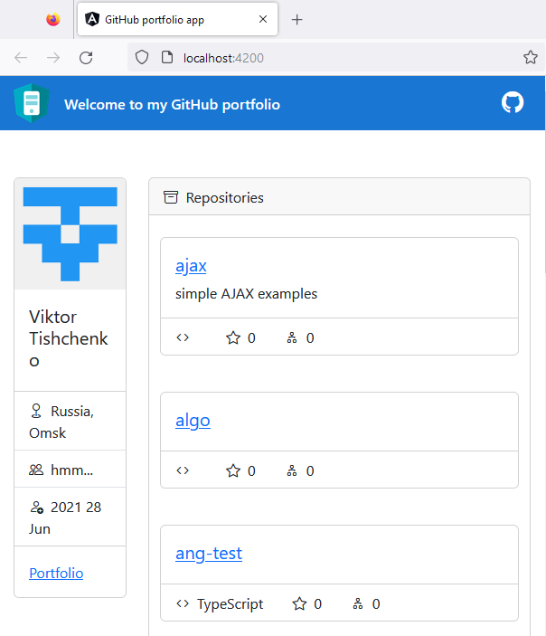
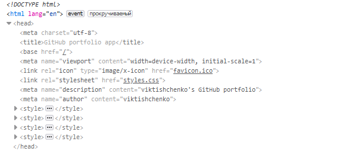

# AngFolio

This project was generated with [Angular CLI](https://github.com/angular/angular-cli) version 15.2.2.

## Development server

Run `ng serve` for a dev server. Navigate to `http://localhost:4200/`. The application will automatically reload if you change any of the source files.

## Code scaffolding

Run `ng generate component component-name` to generate a new component. You can also use `ng generate directive|pipe|service|class|guard|interface|enum|module`.

## Build

Run `ng build` to build the project. The build artifacts will be stored in the `dist/` directory.

## Running unit tests

Run `ng test` to execute the unit tests via [Karma](https://karma-runner.github.io).

## Running end-to-end tests

Run `ng e2e` to execute the end-to-end tests via a platform of your choice. To use this command, you need to first add a package that implements end-to-end testing capabilities.

## Further help

To get more help on the Angular CLI use `ng help` or go check out the [Angular CLI Overview and Command Reference](https://angular.io/cli) page.

---

<details>

<summary>ep.1</summary>

- init angular app w bootstrap&icons

```js
// disables routing because spa, use scss, current dir (check minimal)
ng new ang-folio --routing=false --style=scss --directory ./ // --minimal

npm i bootstrap
npm install bootstrap-icons
// `src/style.scss`
// when import w @import rule, wc omit file extension
@import "~bootstrap/dist/css/bootstrap.min.css";
@import "~bootstrap-icons/font/bootstrap-icons.css";

```

- add Angular logo [from](https://angular.io/presskit)

- add environments & basic layout

```js
ng generate environments

// add to `app.component.ts`
import { environment } from './../environments/environment';

export class AppComponent {
username = environment.username;
}
```


- add service, component, interface

```js
ng g s services/github --skip-tests --dry-run ng g c views/person-info --skip-tests --dry-run
ng g i modules/user --dry-run
```

- get user

```js
// `person-info.ts`
export class PersonInfoComponent implements OnInit {
  user$: Observable<IUser> | undefined;

  constructor(private githubService: GithubService) {}

  ngOnInit(): void {
    this.user$ = this.githubService.getUser();
  }
}
```

```html
// `person-info.html`
<div class="card" *ngIf="user$ | async as user">// ... smth</div>
/* The main advantage of the async pipe is that it unsubscribes from the observable automatically when a component is destroyed, avoiding potential memory leaks */
```


</details>

<details>

<summary>ep.2</summary>

- add comp (user repos listing), interface

```js
ng g c views/panel --skip-tests --dry-run
ng g i modules/repository --dry-run

```

- refactor service URL

```js
export class GithubService {

  private userUrl: string = '';

  constructor(private http: HttpClient) {
    // like this →
    this.userUrl = `${environment.apiUrl}/users/${environment.username}`;
  }

  getUser(): Observable<User> {
    //  →
    return this.http.get<User>(this.userUrl);
  }

  getRepos(): Observable<Repository[]> {
    //  →
    return this.http.get<Repository[]>(this.userUrl + '/repos');
  }
```

- add fetch repos data from API, display w comp (pass data w @ Input)

```js
ng g  c views/repos --skip-tests --dry-run

// `.ts`
export class ReposComponent implements OnInit {
  repos$: Observable<IRepository[]> | undefined;

  constructor(private githubService: GithubService) {}

  ngOnInit(): void {
    this.repos$ = this.githubService
      .getRepos()
      .pipe(map((repos) => repos.filter((repo) => !repo.fork)));
    console.log(this.repos$.forEach((el) => console.log('el>>', el)));
  }
}
```


- add interface

```js
ng g i models/orgs --dry-run

export interface IOrgs {
  // ...
}
```

- add componemt & method

```js
ng g c views/orgs --skip-tests --inline-style --inline-template --dry-run
//`service.ts`
  getOrgs(): Observable<IOrgs[]> {
    return this.http.get<IOrgs[]>(this.userUrl + '/orgs');
  }
// `comp.ts`
import { Component, OnInit } from '@angular/core';
import { Observable } from 'rxjs';
import { IOrgs } from 'src/app/modules/orgs';
import { GithubService } from 'src/app/services/github.service';

@Component({
  selector: 'app-orgs',
  template: `
    <app-panel caption="Organizations" icon="diagram-3">
      <div class="list-group">
        <a
          href="https://www.github.com/{{ org.login }}"
          class="list-group-item list-group-item-action"
          *ngFor="let org of orgs$ | async"
        >
          <div class="row">
            
            <div class="col-sm-9">
              <div class="d-flex w-100 justify-content-between">
                <h5 class="mb-1">{{ org.login }}</h5>
              </div>
              <p class="mb-1">{{ org.description }}</p>
            </div>
          </div>
        </a>
      </div>
    </app-panel>
  `,
  styles: [
    `
      img {
        width: 60px;
        height: 40px;
      }
    `,
  ],
})
export class OrgsComponent implements OnInit {
  orgs$?: Observable<IOrgs[]>;

  constructor(private githubService: GithubService) {}

  ngOnInit(): void {
    this.orgs$ = this.githubService.getOrgs();
  }
}
```

</details>

<details>

<summary>ep.3</summary>

## Integrating Angular Universal

```js

ng add @nguniversal/express-engine
```


- fix selector errors: legend+\*

`server.ts`

```js
server.engine(
  "html",
  ngExpressEngine({
    bootstrap: AppServerModule,
    inlineCriticalCss: false, // <- added
  })
);
```

- add prerendering content during build

```js
npm run prerender

// fix prerender issue with Angular 16 and Bootstrap 5
"optimization": {
    "scripts": true,
    "styles": {
          "minify": true,
          "inlineCritical": false
          },
    "fonts": true
},
"outputHashing": "all",
"sourceMap": false,
"namedChunks": false,
"aot": true,
"extractLicenses": true,
"vendorChunk": false,
"buildOptimizer": true
```

`→ res: `


```js
npm run serve:ssr
```

### Angular Universal SSR Double Loading

<details>

<summary>hydration (not working w v.15.2.0)</summary>

<!-- Hydration is the process that restores the server side rendered application on the client. This includes things like reusing the server rendered DOM structures, persisting the application state, transferring application data that was retrieved already by the server, and other processes. -->

`app.module.ts`

```js
// enable hydration
@NgModule({
  declarations: [RootCmp],
  bootstrap: [RootCmp],
  providers: [provideClientHydration()],
})
export class AppModule {}
```

```js
import {provideClientHydration} from '@angular/platform-browser';
// ...

@NgModule({
  // ...
  providers: [ provideClientHydration() ],  // add this line
  bootstrap: [ AppComponent ]
})
export class AppModule {
  // ...
}

// run
npm run dev:ssr
```

</details>

<details>

<summary>TransferHttpCacheModule</summary>
<!--
The application makes one HTTP request for the browser rendered version and another for the SSR application because both versions have a different state. TransferHttpCacheModule solves the problem by installing an HTTP interceptor in the Angular application that ignores HTTP requests that have been handled by the server initially -->

`app.module.ts`

```js
import { TransferHttpCacheModule } from '@nguniversal/common';

@NgModule({
  imports: [
    TransferHttpCacheModule,
  ]
})


// execute the following
npm run prerender

// run
npm run serve:ssr

```

</details>


### Enhancing SEO capabilities

`app.component.ts`

```js
import { Component, OnInit } from '@angular/core';
import { environment } from './../environments/environment';
import { Title } from '@angular/platform-browser';

@Component({
  selector: 'app-root',
  templateUrl: './app.component.html',
  styleUrls: ['./app.component.scss'],
})
export class AppComponent implements OnInit {
  username = environment.username;

  constructor(private title: Title) {}
  ngOnInit(): void {
    this.title.setTitle('GitHub portfolio app');
  }
}

// run it
npm run dev:ssr
```



<!-- Similar to the Title service, we can use the Meta service to set meta tags for our application -->

`app.component.ts`

```js
import { Component, OnInit } from '@angular/core';
import { Meta } from '@angular/platform-browser';

export class AppComponent implements OnInit {
  username = environment.username;

  constructor(private title: Title, private meta: Meta) {}

  ngOnInit() {
    this.title.setTitle('GitHub portfolio app');
    this.meta.addTags([
      {
        name: 'description',
        content: `${this.username}'s GitHub portfolio`
      },
      {
        name: 'author',
        content: this.username
      }
    ]);
  }
}
```

### SEO data



## The Fin!

</details>
